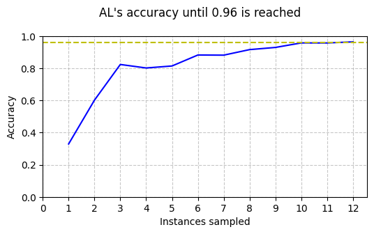
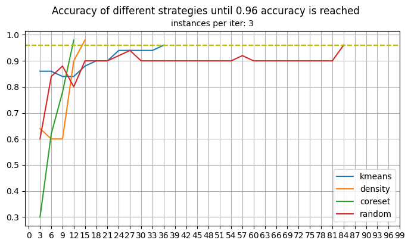

# Active learning

[](https://github.com/astral-sh/ruff)
[](https://github.com/pre-commit/pre-commit) 

Active Learning is a subfield of machine learning where the model iteratively queries the most relevant unlabeled data points, to optimize performance with minimal labeled data.
This project provides the implementation of various Active Learning query strategies, for an easy application and comparison of different types of acquisition functions. The Active Learning framework is based on [modAL](https://github.com/modAL-python), a popular package for Python.

## Structure
The repository includes the following features:

- The main scripts `AL_cycle.py` and `AL_selection.py`, which contain functions that can be used to execute an active learning cycle with the specified parameters and to compare the performances of different query strategies.
- The `activelearning/queries` folder contains the different query strategies that are implemented, both for the pool based and stream based scenario. More detail on this below.
- The `activelearning/utils` folder contains helper functions for the main scripts and examples.
- The `examples` folder contains some demostrative notebooks to show how the main features work.
- The `docs` folder contains additional documentation.


## Installation
The repository is setup us as a poetry project and by default requires Python 3.10 or later.
To install the repository you can follow these steps:

First, install `poetry` if you haven't already, as indicated by the instructions on the [Poetry installation page](https://python-poetry.org/docs/).
Then, clone the repository to your local machine using the following command:
```
git clone https://github.com/orobix/active-learning
cd active-learning
```
Use Poetry to install the project dependencies:
```
poetry install
```
Finally, activate the virtual environment created by Poetry:
```
poetry shell
```


## Introduction on Active Learning

Active Learning aims to save time and labeling costs by reducing the amount of labeled data required to train models, as annotation is often an expensive and laborious task. The solution is iteratively selecting a small set of the most relevant samples from unlabeled data, and querying an oracle for their label. This can allow to train a model with high accuracy while spending less resources on the construction of the dataset.

For example, when using a random forest classifier on the _Iris_ dataset, and randomly choosing one instance to be labeled at every iteration, it's possible to reach the same accuracy that the model would have when using the whole training set (96%) with only 12 data points.



## Query strategies

Query strategies, also called acquisition functions, are the criteria with which data points are selected to be labeled. **Representation based** query strategies try to explore the whole feature space to find samples that are representative of the whole data. They are agnostic methods, as they don't require the training of a model.
Implemented resentation based query strategies are:
* Information density query
* K-Means cluster-based query
* Diversity query
* Coreset query
* ProbCover query

**Information based** query strategies rely on a model trained on a small labeled set of data, and search on the most informative unlabeled sampled according to the model predictions, measured for example with uncertainty criterias. In this category are also **Query by committee** methods, which measure informativeness with the prediction of a committee of models.
Implemented information based query strategies are:
* Least Confindent uncertainty sampling
* Margin uncertainty sampling
* Entropy uncertainty sampling
* QBC vote entropy sampling
* QBC consensus entropy sampling
* QBC max disagreement sampling

**Bayesian Optimization** based strategies rely on stochastic forward passes in a neural net classifier, referred to as Monte Carlo Dropout, to approximate Bayesian posterior probabilities and measure uncertainty.
Implemented Bayesian query strategies are:
* MC max entropy
* BALD (Bayesian Active Learning by Disagreements)
* Max variation ratios
* Max mean std

## Stream based scenario

When data points arrive one at a time from a stream, instead of having a pool of unlabeled data to select from, there are two options: in **Batch setting** samples are saved until a batch is complete, and then the classical query strategies can be performed on the batch; in the pure **Stream** setting, a criteria is used to decide whether to query the new point or discard it.
Implemented stream based query stratgies are:
* Stream diversity query
* Stream Coreset query
* Stream ProbCover query
* Stream LC uncertainty sampling
* Stream Margin uncertainty sampling
* Stream Entropy uncertainty sampling

## Example

The functions in this repository can be used to effectively compare the effectiveness of different query strategies on a labeled dataset, in order to be able to choose the appropriate one in real applications with unlabeled data. With the following script we can compare some representation-based strategies on the _Iris_ dataset:

```
scores = strategy_comparison(
    X_train=None, y_train=None,
    X_pool=X_pool, y_pool=y_pool,
    X_test=X_test, y_test=y_test,
    classifier="randomforest",
    query_strategies=[query_kmeans_foreach, query_density, query_coreset, query_random],
    n_instances=n_instances,
    K=3,  # number of clusters for k-means query
    metric="euclidean",  # metric for density query
    goal_acc=0.96,
)
```


Detail of this implentation can be found in `examples/1_iris.ipynb`

## Resources

- [modAL documentation](https://modal-python.readthedocs.io/en/latest/)
- [A Survey on Active Learning: State-of-the-Art, Practical Challenges and Research Directions (Tharwat & Schenck, 2023)](https://www.mdpi.com/2227-7390/11/4/820)
- [A Survey on Deep Active Learning: Recent Advances and New Frontiers (Li et al., 2024)](https://ieeexplore.ieee.org/abstract/document/10537213)
